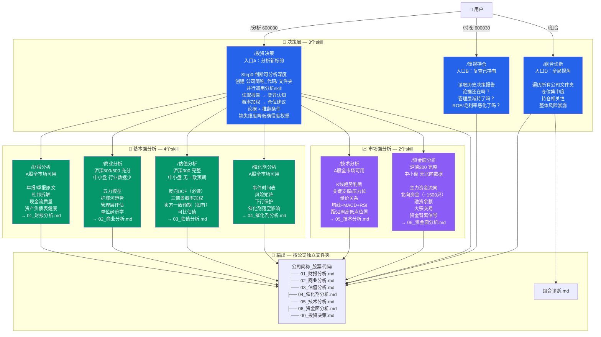
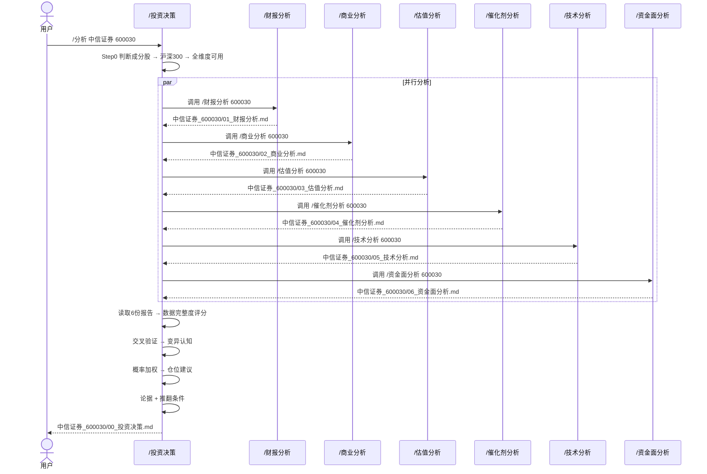
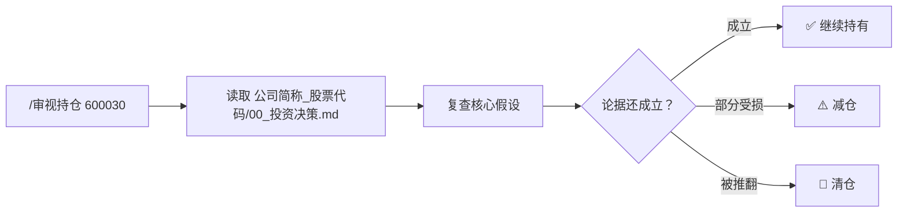
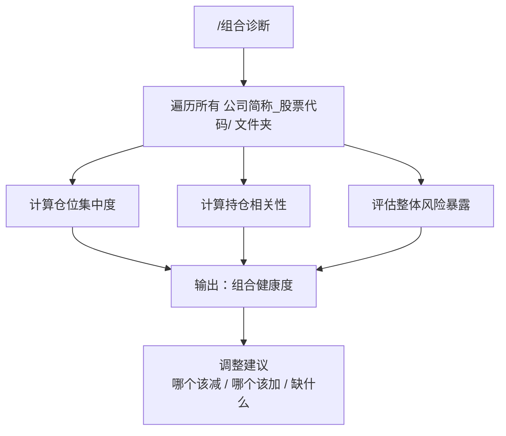

# 投资分析 Skill 架构

## 适用范围与深度

```
所有A股（沪深主板 / 创业板 / 科创板）均可分析，深度因成分股规模而异：

┌─────────────────────────────────────────────────────────────┐
│ 沪深300成分            中证500成分          其余中小盘        │
│                                                             │
│ 财报分析   ✅ 完整      财报分析   ✅ 完整    财报分析   ✅ 完整│
│ 商业分析   ✅ 充分      商业分析   ✅ 充分    商业分析   ⚠️ 缺细分│
│ 估值分析   ✅ 一致预期  估值分析   ⚠️ 部分   估值分析   ❌ 无预期│
│ 催化剂分析 ✅           催化剂分析 ✅         催化剂分析 ✅     │
│ 技术分析   ✅           技术分析   ✅         技术分析   ✅     │
│ 资金面分析 ✅ 北向+主力  资金面分析 ⚠️ 部分   资金面分析 ❌ 无北向│
│                                                             │
│ 深度：⭐⭐⭐⭐⭐        深度：⭐⭐⭐⭐          深度：⭐⭐⭐       │
└─────────────────────────────────────────────────────────────┘

关键限制：
  • 北向资金只覆盖沪港通/深港通标的（~1500只），其余查不到
  • 卖方一致预期只在被分析师覆盖的公司存在（~2000只）
  • 数据维度不足时 → 标注"不适用，原因：……" → 不编造数据
  • /投资决策 汇总时会根据数据完整度下调确信度权重
```

---

## 数据来源体系

系统采用**多层数据源架构**，对标机构投研流程：

### 第一层：法定披露（最权威，curl可获取）
| 来源 | 内容 | 覆盖 |
|------|------|------|
| **巨潮资讯网** (cninfo.com.cn) | A股全部公告原文：年报/季报/招股书/董事会决议/减持公告 | 全A股 |
| **上交所** (sse.com.cn) | 沪市公告、科创板IPO审核状态、监管问询函、月度市场统计 | 沪市 |
| **深交所** (szse.cn) | 深市公告、创业板IPO审核状态、投资者互动问答 | 深市 |
| **香港交易所** (hkex.com.hk) | 北向资金官方数据、H股公告 | 沪深港通标的 |
| **证监会** (csrc.gov.cn) | 行政处罚、IPO审核结果、监管规则 | 全市场 |
| **中国结算** (chinaclear.cn) | 新增投资者数、限售股解禁、质押登记 | 全市场 |

### 第二层：金融数据平台（结构化提取）
| 来源 | 内容 | 获取 |
|------|------|------|
| **东方财富** | 财务摘要、资金流向、北向持股、研报、公告、大宗交易 | curl + 网页解析 |
| **同花顺** | 一致预期、技术指标、股东研究、龙虎榜 | curl + 网页解析 |
| **新浪财经** | 年报/季报原文、实时行情、历史K线 | curl（GB2312→UTF-8） |
| **中财网** (cfi.cn) | 年报TXT版（易于解析） | curl |

### 第三层：行业与宏观（官方统计）
| 来源 | 内容 | 获取 |
|------|------|------|
| **中国证券业协会** (sac.net.cn) | 券商行业经营数据、各业务线排名 | curl（免费公开） |
| **中国基金业协会** (amac.org.cn) | 资管规模排名、基金公司数据 | curl（免费公开） |
| **国家统计局** (data.stats.gov.cn) | GDP/CPI/PMI/工业利润/消费零售 | curl下载Excel/CSV |
| **中国人民银行** (pbc.gov.cn) | M1/M2/社融/LPR/MLF | curl + 网页解析 |
| **中国货币网** (chinamoney.com.cn) | SHIBOR/DR007/同业存单利率 | curl（免费公开） |
| **中国债券信息网** (chinabond.com.cn) | 国债收益率曲线、信用评级（MIR/MIDR） | curl（免费公开） |

### 第四层：公司治理穿透
| 来源 | 内容 | 获取 |
|------|------|------|
| **企查查/天眼查** | 实际控制人穿透、司法风险、关联方、股权结构 | API（免费额度可用） |
| **国家企业信用信息公示系统** (gsxt.gov.cn) | 注册资本、行政处罚、质押、经营异常 | curl（有验证码风险） |

### 第五层：程序化接口（数据干净，适合量化）
| 来源 | 成本 | 适用场景 |
|------|------|----------|
| **AKShare** | 完全免费 | A股全数据一站式获取，pip安装 |
| **Tushare Pro** | 免费200次/天 | 财务三表/资金流向/融资融券结构化数据 |
| **Baostock** | 完全免费 | 历史K线数据，无需注册 |

### 数据源选择原则
- **首选法定披露**（巨潮资讯网/交易所）：最权威，不可篡改
- **交叉验证**：同一指标至少从2个来源确认
- **数据缺失时降级标注**：写明"获取失败/不适用"，不编造
- **学术论文级引用**：每个数据点标注来源编号[1][2]，报告末尾列出完整出处表

---



---

## 时序图：/投资决策 调用流程



---

## 持仓复查流程



---

## 组合诊断流程



---

## 文件目录结构

```
宇树IPO分析/
├── 中信证券_600030/
│   ├── 01_财报分析.md
│   ├── 02_商业分析.md
│   ├── 03_估值分析.md
│   ├── 04_催化剂分析.md
│   ├── 05_技术分析.md
│   ├── 06_资金面分析.md
│   └── 00_投资决策.md
│
├── 蔚蓝锂芯_002245/
│   ├── 01_财报分析.md
│   ├── ...
│   └── 00_投资决策.md
│
├── {公司简称}_{股票代码}/
│   └── ...
│
├── 组合诊断.md
├── skill_架构.md
└── skill_架构.mmd
```

---

## 6个分析skill — 覆盖范围与约束

### 基本面分析（绿色）

| Skill | 覆盖范围 | 数据不足时 | 输出路径 |
|------|------|------|------|
| `/财报分析` | ✅ A股全部 | — 年报/季报公开披露，不存在拿不到 | `{简称}_{代码}/01_财报分析.md` |
| `/商业分析` | ✅ 沪深300/500 充分<br/>⚠️ 中小盘 细分行业数据少 | 标注"XX行业数据未公开获取"，不做跨行业类比 | `{简称}_{代码}/02_商业分析.md` |
| `/估值分析` | ✅ 沪深300 卖方一致预期完整<br/>⚠️ 中证500 部分覆盖<br/>❌ 其余 无一致预期 | 只做反向DCF + 历史分位，标注"无卖方一致预期" | `{简称}_{代码}/03_估值分析.md` |
| `/催化剂分析` | ✅ A股全部 | — 公告/行业新闻公开可查 | `{简称}_{代码}/04_催化剂分析.md` |

### 市场面分析（紫色）

| Skill | 覆盖范围 | 数据不足时 | 输出路径 |
|------|------|------|------|
| `/技术分析` | ✅ A股全部 | — K线/量价公开可查 | `{简称}_{代码}/05_技术分析.md` |
| `/资金面分析` | ✅ 沪港通/深港通标的（~1500只）<br/>❌ 其余 无北向数据 | 标注"非沪深港通标的，北向资金数据不适用"；主力/融资仍可查 | `{简称}_{代码}/06_资金面分析.md` |

### 技术面 vs 资金面 的分工

```
/技术分析                            /资金面分析
├── K线趋势（上升/下降/横盘）           ├── 主力资金：净流入还是流出？趋势？
├── 关键支撑位 / 压力位                 ├── 北向资金：在加仓还是跑路？（仅~1500只）
├── 量价关系（放量涨还是放量跌）         ├── 融资余额：杠杆资金在加还是减？
├── 均线排列（多头/空头/缠绕）           ├── 大宗交易：谁在接、谁在倒？
├── MACD 零轴上下 / 金叉死叉            ├── 资金成分：机构 vs 游资 vs 散户
├── KDJ / RSI 超买超卖                 ├── 背离信号：价格跌+资金进 = 低吸
└── 距52周高低点的位置                  │             价格涨+资金出 = 出货
                                       └── 板块资金轮动：钱在往哪个方向流
```

## 3个决策skill的输入输出

| Skill | 输入 | 做什么 | 数据不完整时的处理 | 输出 |
|------|------|------|------|------|
| `/投资决策` | 股票代码 | Step0判断成分股 → 创建文件夹 → 并行调用分析skill → 读报告 → 数据完整度评分 → 变异认知 → 仓位 | 缺失维度标注原因，下调确信度一档 | `{简称}_{代码}/00_投资决策.md` |
| `/审视持仓` | 股票代码 | 读决策报告 → 复查论据 → 判断持有/减仓/清仓 | — | 操作建议 |
| `/组合诊断` | 无 | 遍历所有公司文件夹 → 读所有决策报告 → 集中度/相关性/风险暴露 → 调整建议 | — | `组合诊断.md` |
